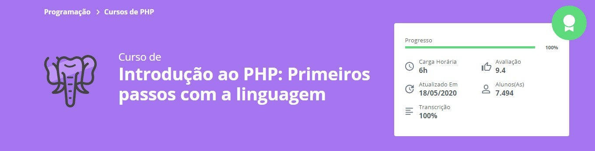

<h1 align="center">:elephant:Introdução ao PHP:elephant:</h1>

Curso de  introdução ao PHP: Primeiros passos com a linguagem

        

## :clipboard: Visão Geral
        Repositório criado para armazenar códigos com intuito apenas de aprender.
O PHP (um acrônimo recursivo para PHP: Hypertext Preprocessor) é uma linguagem de script open source de uso geral, muito utilizada, e especialmente adequada para o desenvolvimento web e que pode ser embutida dentro do HTML.
#### Porque decidi aprender PHP?
Para alguém que busca se aprofundar na área de programação web, além de Javascript, PHP tem uma forte atuação nesse território. Embora seja amada por uns e odiadas por outros, 80% da internet atualmente foi criada e tem a sua manutenção em PHP com uma trajetória de quase 20 anos. Além de outras razões como ter uma presença forte no mercado, flexibilidade e comunidade gigantesca, PHP possivelmente será minha lingugagem secundária.
## :books: O que  foi desenvolvido no curso?

- O que é o PHP
- Variáveis e tipos
- Trabalhando com textos
- Repetindo decisões
- Desafios complementares.

## :link: Links

- Acesso o curso: https://cursos.alura.com.br/course/php-primeiros-passos
- https://www.linkedin.com/in/guilhermesoterio/
- https://www.php.net/manual/pt_BR/index.php
